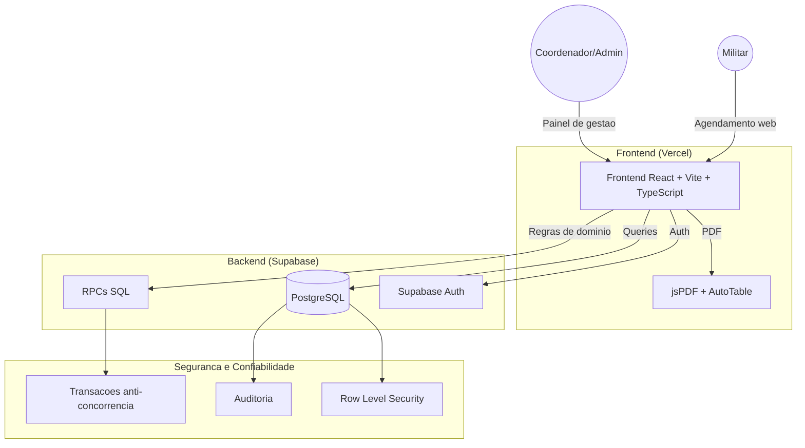
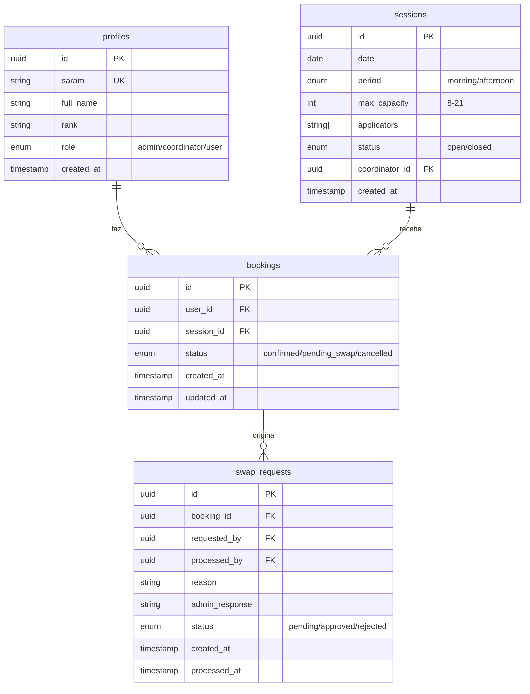
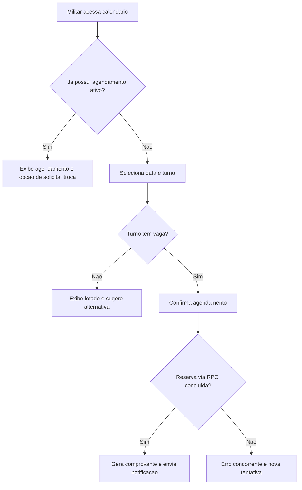
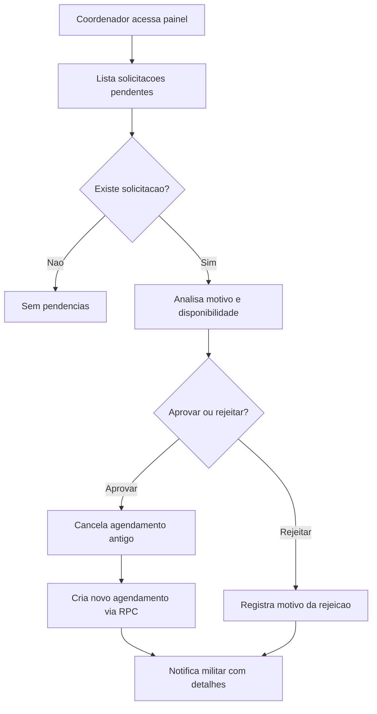

# Documentacao do Projeto: TACF Digital - HACO

## 0. Resumo Executivo

O TACF Digital e uma plataforma web para agendamento e gestao de sessoes no contexto militar.
A interface facilita operacoes para Militar, Coordenador e Admin, enquanto as regras de negocio
criticas (capacidade, quorum, concorrencia e auditoria) sao garantidas no banco via Supabase RPCs,
migrations e politicas RLS.

Objetivos principais:

- Simplificar o agendamento por turno (manha/tarde).
- Garantir privacidade de dados conforme LGPD.
- Manter rastreabilidade completa de alteracoes e decisoes.
- Dar previsibilidade operacional ao HACO com relatorios e governanca.

---

## 1. Folha de Requisitos (Business Requirements Document)

Baseado no contexto operacional do Hospital da Aeronautica de Canoas (HACO).

| ID     | Requisito            | Descricao Tecnica                                                                                                                               | Criticidade |
| ------ | -------------------- | ----------------------------------------------------------------------------------------------------------------------------------------------- | ----------: |
| REQ-01 | Turnos e Capacidade  | O sistema opera por turnos (Manha/Tarde), sem horario fixo por pessoa. Capacidade por turno configuravel entre 8 e 21.                          |        Alta |
| REQ-02 | Sazonalidade         | Agendamento habilitado em campanhas (Fev-Mai e Set-Nov). Fora do periodo, sistema em modo leitura/fechado para novos agendamentos.              |       Media |
| REQ-03 | Privacidade de Dados | Militar nao pode ver lista nominal de outros militares no mesmo dia/turno. Apenas perfis autorizados (Admin/Coordenador) acessam lista nominal. |     Critica |
| REQ-04 | Fluxo de Troca       | Militar nao altera data confirmada diretamente. Deve abrir solicitacao de troca, sujeita a aprovacao do Coordenador.                            |        Alta |
| REQ-05 | Gestao de Sessao     | Coordenador registra aplicadores da sessao e observacoes operacionais para uso em impressao e relatorios.                                       |       Media |
| REQ-06 | Notificacoes         | Sistema envia comunicacoes de confirmacao, cancelamento e troca (aprovada/rejeitada).                                                           |       Media |
| REQ-07 | Usabilidade          | Fluxo de agendamento deve ser simples, claro e com feedback imediato em cada etapa.                                                             |       Media |
| REQ-08 | Relatorios           | Admin visualiza relatorios por periodo/local/status para suporte a decisao operacional.                                                         |       Baixa |
| REQ-09 | Seguranca e Acesso   | Autenticacao e autorizacao por perfil com RLS no banco e menor privilegio por recurso.                                                          |     Critica |
| REQ-10 | Auditabilidade       | Decisoes e mudancas de estado devem ser registradas com usuario, data/hora e motivo.                                                            |        Alta |
| REQ-11 | Concorrencia         | Criacao de reservas deve ser atomica no banco para evitar overbooking em cenarios concorrentes.                                                 |        Alta |

---

## 2. Arquitetura da Solucao

### 2.1 Diagrama de Alto Nivel (Mermaid)



### 2.2 Stack Tecnologica

- Frontend: React 18, TypeScript, Vite, Tailwind CSS.
- Backend/BaaS: Supabase (Auth, PostgreSQL, RPC).
- Banco de dados: PostgreSQL.
- Hospedagem: Vercel (frontend) + Supabase Cloud (backend).
- CI/CD: GitHub Actions.
- Bibliotecas relevantes:
  - `jspdf` + `jspdf-autotable` para geracao de PDF.
  - `react-qr-code` para representacao de comprovante quando aplicavel.

### 2.3 Principios Arquiteturais

- Regras de dominio ficam no banco (`supabase/rpc/`, `supabase/migrations/`).
- Frontend nao implementa validacao critica de negocio, apenas orquestra UX e exibe feedback.
- Integracao com banco centralizada no wrapper `src/services/supabase.ts`.
- Seguranca por camadas: Auth, autorizacao por perfil e RLS.

---

## 3. Build, Teste e CI

### 3.1 Qualidade Minima Obrigatoria

- TypeScript em modo strict (`strict: true`).
- Lint sem erros.
- Build de producao concluindo sem falhas.

### 3.2 Comandos recomendados na pipeline

```bash
yarn lint
npx tsc --noEmit
yarn test
yarn build
```

### 3.3 Jobs sugeridos no GitHub Actions

- `lint`
- `typecheck`
- `test`
- `build`

Todos bloqueantes para merge em PR.

### 3.4 Observacao sobre E2E

A automacao E2E com Playwright foi removida nesta branch de trabalho; reintroduzir em PR dedicado quando necessario.

### 3.5 Regras para alteracoes em `supabase/`

Mudancas em `supabase/migrations`, `supabase/policies` ou `supabase/rpc` devem:

- ter motivacao documentada;
- incluir SQL versionado;
- receber revisao humana explicita do coordenador (HACO) antes do merge.

---

## 4. Modelagem de Banco de Dados (Visao Conceitual)

Estrutura relacional para suportar agendamento, trocas e trilha de auditoria.



### 4.1 Constraints Criticos

1. `UNIQUE(user_id, campaign_or_semester)` em `bookings` para evitar mais de um agendamento ativo no mesmo ciclo.
2. `CHECK(max_capacity BETWEEN 8 AND 21)` em `sessions`.
3. RLS em tabelas sensiveis:
   - `profiles`: usuario ve o proprio perfil; admin/coordenador conforme privilegio.
   - `sessions`: usuario ve disponibilidade; dados nominais somente para perfis autorizados.
   - `bookings`: usuario ve apenas os proprios registros.
4. Integridade e concorrencia tratadas em RPC transacional para reserva e troca.

---

## 5. Planejamento de Entregas (Roadmap)

### Fase 1: Fundacao (Setup + Banco)

Escopo:

- Estrutura de repositorio e padroes de qualidade.
- Provisionamento Supabase e variaveis de ambiente.
- Migrations iniciais e RLS.

Entregavel:

- Banco funcional com politicas de seguranca e pipeline basica ativa.

### Fase 2: Core de Agendamento

Escopo:

- Autenticacao e protecao de rotas.
- Calendario de sessoes com disponibilidade por turno.
- Reserva via RPC com tratamento de concorrencia.

Entregavel:

- Militar agenda e consulta status com comprovante e feedback claro.

### Fase 3: Operacao Administrativa

Escopo:

- Painel de Coordenador/Admin para sessoes e aplicadores.
- Fluxo completo de solicitacao/aprovacao de troca.
- Relatorios e exportacoes operacionais.

Entregavel:

- Operacao fim a fim com governanca, rastreabilidade e visao analitica.

### Fase 4: Hardening e Escala

Escopo:

- Observabilidade e alertas.
- Otimizacoes de performance e custo.
- Fortalecimento de testes de regressao.

Entregavel:

- Plataforma estavel e preparada para ciclos recorrentes de campanha.

---

## 6. Fluxogramas de Processos Criticos

### 6.1 Agendamento de Militar



### 6.2 Aprovacao de Troca (Coordenador)



---

## 7. Matriz de Riscos

| Risco                                         | Probabilidade | Impacto | Mitigacao                                                          |
| --------------------------------------------- | ------------- | ------- | ------------------------------------------------------------------ |
| Corrida de concorrencia em horario disputado  | Media         | Alto    | Reserva atomica em RPC + transacao + lock adequado                 |
| Exposicao indevida de dados de militares      | Baixa         | Critico | RLS rigoroso + revisao de queries + testes de permissao            |
| Indisponibilidade parcial do Supabase         | Baixa         | Alto    | Monitoramento, retry controlado e comunicacao de indisponibilidade |
| Problemas de UX em mobile                     | Media         | Medio   | Validacao responsiva, testes em diferentes tamanhos e navegadores  |
| Divergencia entre regra de negocio e frontend | Media         | Alto    | Centralizar regra no banco e revisar contratos de RPC              |

---

## 8. Definicao de Pronto (DoD)

Uma entrega so e considerada pronta quando:

- Tipagem TypeScript clara e sem uso indevido de `any`.
- Lint e typecheck aprovados.
- Build de producao concluida.
- Fluxo funcional validado manualmente no caminho principal.
- Regras de permissao e privacidade validadas (RLS).
- Documentacao tecnica atualizada quando houver impacto.

---

## 9. Referencias

- [Supabase Auth](https://supabase.com/docs/guides/auth)
- [Supabase RLS](https://supabase.com/docs/guides/auth/row-level-security)
- [PostgreSQL Documentation](https://www.postgresql.org/docs/)
- [jsPDF](https://github.com/parallax/jsPDF)

---

Ultima atualizacao: 06 de marco de 2026
Responsavel: Equipe TACF Digital
Stakeholder: Hospital da Aeronautica de Canoas (HACO)
