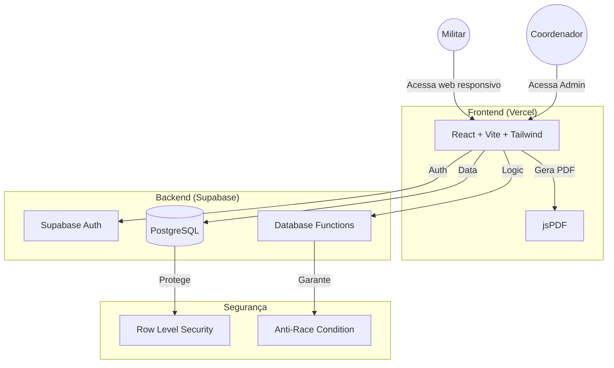
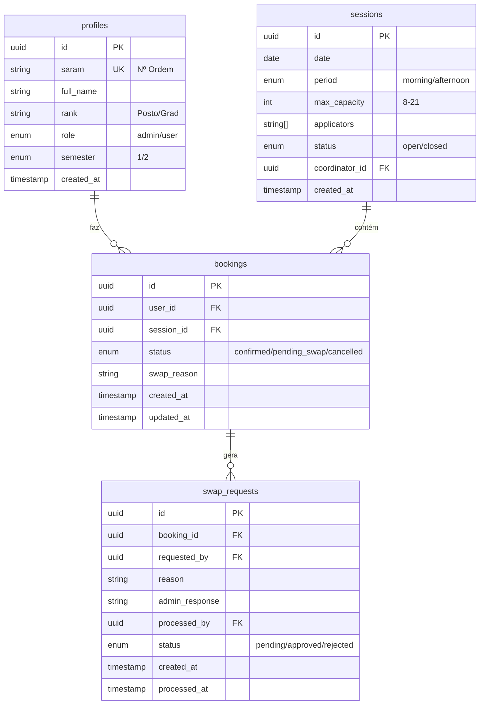
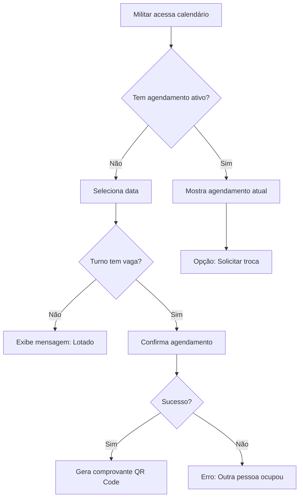
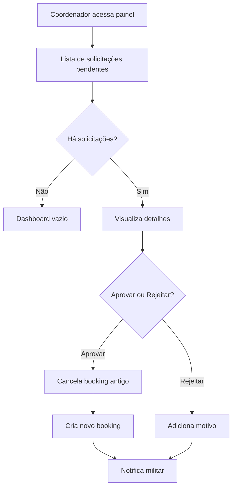

# Documentação do Projeto: TACF Digital - HACO

## 1. Folha de Requisitos (Business Requirements Document)

Baseado no documento oficial do Hospital da Aeronáutica de Canoas (HACO).

| ID     | Requisito           | Descrição Técnica                                                                                                               | Criticidade |
| ------ | ------------------- | ------------------------------------------------------------------------------------------------------------------------------- | ----------- |
| REQ-01 | Turnos e Capacidade | O sistema não usa horários fixos, apenas turnos (Manhã/Tarde). Capacidade dinâmica entre 8 e 21 pessoas por turno.              | Alta        |
| REQ-02 | Sazonalidade        | O sistema opera em campanhas (Fev-Mai e Set-Nov). Fora desses períodos, deve estar fechado ou em modo leitura.                  | Média       |
| REQ-03 | Segurança de Dados  | Um militar não pode ver quem mais está agendado no mesmo dia (Privacidade/LGPD). Apenas o Admin vê a lista nominal.             | Crítica     |
| REQ-04 | Fluxo de Troca      | O militar não pode alterar a data sozinho após confirmada. Deve solicitar troca para aprovação do Coordenador (Auditabilidade). | Alta        |
| REQ-05 | Gestão de Sessão    | O Coordenador deve inserir nomes dos Aplicadores (Sgt X, Ten Y) no dia para constar na impressão.                               | Média       |

---

## 2. Arquitetura da Solução

### Diagrama de Fluxo (Mermaid)



### Stack Tecnológica Definida

- **Frontend**: React 18, TypeScript 5.9, Vite, TailwindCSS v4, Lucide Icons
- **Backend**: Supabase (BaaS)
- **Banco de Dados**: PostgreSQL 15+
- **Hospedagem**: Vercel (Front) + Supabase Cloud (Back)
- **CI/CD**: GitHub Actions
- **Bibliotecas Especiais**:
- `jspdf` + `jspdf-autotable` - Geração de PDF
  - Design responsivo: abordagens mobile-first e testes em dispositivos

- **CI/CD**: GitHub Actions (lint, typecheck, build, testes)
- **Bibliotecas Especiais**:
  - `jspdf` + `jspdf-autotable` — geração de PDFs (listas de chamada)
  - Design responsivo: abordagens mobile-first e testes em dispositivos

---

## Build, Test e CI

- **TypeScript strict:** o projeto deve usar `strict: true` no `tsconfig.json`. Como verificação automática, a pipeline deve rodar `npx tsc --noEmit`.
- **Comandos mínimos em CI:**

```
yarn lint
npx tsc --noEmit
yarn test
yarn build
```

- **Jobs sugeridos (GitHub Actions):** `lint`, `typecheck`, `test`, `build` — todos obrigatórios antes do merge de PR.
- **Auditoria de dependências (opcional):** `yarn audit`/`npm audit` para capturar vulnerabilidades conhecidas.

- **Regras para alterações em `supabase/`:** quaisquer mudanças em `supabase/migrations`, `supabase/policies` ou `supabase/rpc` devem ser acompanhadas por uma _issue_ descrevendo a motivação, incluir migration SQL versionada em `supabase/migrations/` e requerer revisão explícita do coordenador (HACO) antes do merge (ver AGENTS.md para processo).

## 3. Modelagem de Banco de Dados (ER Diagram)

Estrutura relacional para atender os requisitos de auditoria e limites.



### Constraints Críticos

1. **UNIQUE(user_id, semester)** em `bookings` - Um militar só pode ter 1 agendamento ativo por semestre
2. **CHECK(max_capacity BETWEEN 8 AND 21)** em `sessions` - Limite de capacidade validado no banco
3. **RLS Policies**:
   - `profiles`: Usuários veem apenas o próprio perfil; Admins veem todos
   - `sessions`: Qualquer um vê datas/períodos (sem nomes); Admins veem detalhes completos
   - `bookings`: Usuários veem apenas os próprios; Admins veem todos

---

## 4. Planejamento de Sprints (Backlog)

Para organizar o desenvolvimento e o ensino posterior, dividiremos em 3 fases:

### Fase 1: Fundação (Setup & DB)

**Sprint 1-2 (2 semanas)**

- [ ] Configuração do Repositório Git
  - Estrutura de pastas (src/, docs/, public/)
  - ESLint + Prettier configurado
  - GitHub Actions básico (lint + build)
- [ ] Setup do Supabase
  - Criar projeto no Supabase Cloud
  - Configurar variáveis de ambiente (.env.local)
- [ ] Criação das Tabelas
  - Script SQL para `profiles`, `sessions`, `bookings`, `swap_requests`
  - Migração versionada (migrations/)
- [ ] Implementação do RLS (Segurança)
  - Policies para cada tabela
  - Testes de acesso (Admin vs User)

**Entregável**: Banco de dados funcional com RLS + CI/CD básico

---

### Fase 2: Core (O Agendamento)

**Sprint 3-5 (3 semanas)**

- [ ] Autenticação
  - Login com SARAM (número de ordem)
  - Proteção de rotas (PrivateRoute component)
  - Logout e refresh de sessão
- [ ] Visualização do Calendário
  - Componente `Calendar.tsx` (React hooks)
  - Lógica de cores: Verde (disponível) / Vermelho (lotado)
  - Integração com Supabase (fetch sessions + bookings)
- [ ] Lógica de Agendamento
  - Validação de capacidade (8-21)
  - Checagem de duplicidade (1 booking/semestre)
  - Confirmação visual (modal + QR Code do SARAM)
  - Tratamento de race conditions (usar Supabase RPC)

**Entregável**: Usuário consegue agendar e visualizar calendário funcional

---

### Fase 3: Admin & Refino

**Sprint 6-8 (3 semanas)**

- [ ] Painel do Coordenador
  - Componente `AdminSessionManager.tsx`
  - Edição de capacidade (slider 8-21)
  - Adição de Aplicadores (input de array)
  - Visualização da Lista Nominal (respeitando privacidade)
- [ ] Fluxo de Aprovação de Trocas
  - Tela de solicitação (user)
  - Tela de aprovação (admin)
  - Notificações de status
- [ ] Impressão de PDF
  - Função `generateCallList.ts`
  - Formato: Data, Turno, Aplicadores, Lista (SARAM + Nome)
  - Download automático
- [ ] Web responsivo
- Implementação mobile-first e testes em dispositivos
- Meta tags e ícones para integração com navegadores (não PWA)
- Estratégias de cache e performance (HTTP caching, CDN)
- QR Code para acesso rápido (opcional)
- [ ] Testes e Deploy
  - Testes E2E com Playwright (opcional)
  - Deploy no Vercel
  - Configuração de domínio (se aplicável)

**Entregável**: Sistema completo em produção, responsivo para web (não PWA)

---

## 5. Fluxogramas de Processos Críticos

### Processo: Agendamento de Militar



### Processo: Aprovação de Troca (Coordenador)



---

## 6. Matriz de Riscos

| Risco                                | Probabilidade | Impacto | Mitigação                                      |
| ------------------------------------ | ------------- | ------- | ---------------------------------------------- |
| Race condition em agendamento        | Média         | Alto    | Usar transações SQL via Supabase RPC           |
| Militar vê lista de outros           | Baixa         | Crítico | RLS rigoroso + Code review obrigatório         |
| Supabase fora do ar                  | Baixa         | Alto    | Monitoramento + Fallback em cache local        |
| Compatibilidade mobile e navegadores | Média         | Médio   | Testes em múltiplos navegadores e dispositivos |
| Capacidade de 21 excedida            | Média         | Médio   | CHECK constraint no DB + validação no front    |

---

## 7. Checklist de Definição de Pronto (DoD)

Para considerar uma funcionalidade concluída:

- [ ] Código TypeScript com tipos explícitos
- [ ] Testes manuais em Chrome e Safari (mobile)
- [ ] RLS validado (user não vê dados de outros)
- [ ] ESLint sem erros
- [ ] Build (`yarn build`) sem falhas
- [ ] Documentação atualizada (se necessário)
- [ ] Deploy em preview (Vercel)

---

## 8. Referências e Links Úteis

- [Supabase Auth Documentation](https://supabase.com/docs/guides/auth)
- [jsPDF Documentation](https://github.com/parallax/jsPDF)
- [Row Level Security (RLS)](https://supabase.com/docs/guides/auth/row-level-security)
- [React 18 Release Notes](https://react.dev/blog/2024/04/25/react-18-release-notes)

---

**Última atualização**: 17 de fevereiro de 2026
**Responsável**: Equipe TACF Digital
**Stakeholder**: Hospital da Aeronáutica de Canoas (HACO)
